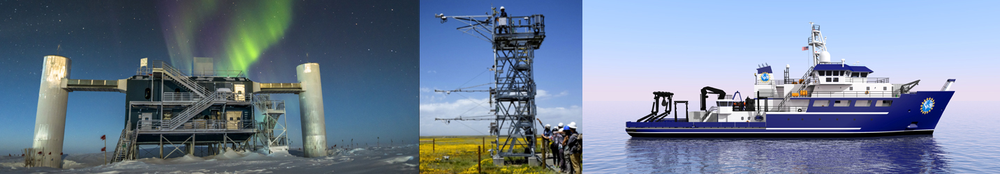
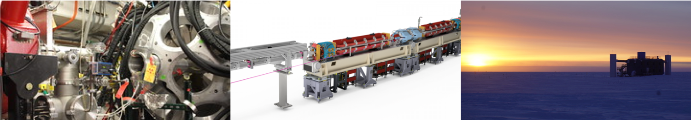
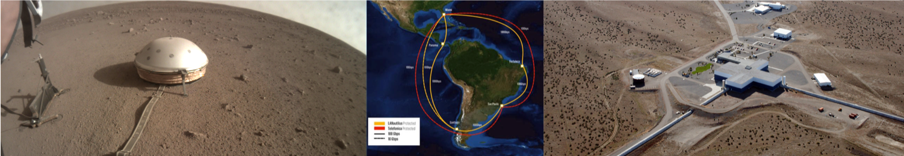

<!-- Slideshow container -->

  <!-- Full-width images with number and caption text -->
  

    
  

  

    
  

  

    
  

  <!-- Next and previous buttons -->
  <!--a class="prev" onclick="plusSlides(-1)">&#10094;</a-->
  <!--a class="next" onclick="plusSlides(1)">&#10095;</a-->

<!-- The dots/circles -->

   
   
   

# Workshop Overview

Cyberinfrastructure (CI) is the fabric of modern science. Large collaborations and 
individual scientists rely on CI to support the entire data lifecycle from data 
capture and processing to data storage and archiving and finally to data access, 
visualization, and dissemination. The Large Facilities (LFs), the biggest scientific 
investments made by the National Science Foundation, are relying on existing CI and 
building new CI capabilities and solutions to support their scientific communities.

The 2017 NSF Large Facilities Cyberinfrastructure Workshop 
([LFCI Workshop](/2017.html)) found that:
> There is also a lack of a facilities' CI community that can collectively address 
> CI sustainability and help provide continuity between existing and future facilities.

In 2017, the LFCI workshop brought together members of LFs and CI providers and 
practitioners to discuss possible avenues of collaboration, share common experiences, 
and discuss common challenges. This workshop aims to continue the discussion started 
in 2017 and to provide a forum for the cyberinfrastructure experts to share ideas 
and experiences and discuss the future of CI and the CI workforce.

## Goals

- Identifying common cyberinfrastructure challenges among LFs
- Understanding the LF data lifecycle, including the commonalities and differences between data lifecycle stages
- Exploring opportunities for joint training and education among LFs and large CI projects
- Sharing experiences in CI project management
- Discussing approaches to building a community of CI professionals among others

<!--div style="width: 100%; text-align: center; padding: 2em">
    

      <a href="assets/reports/facilitiesci-workshop-report-11-17.pdf" class="ui blue label" target="_blank">
        Report from the 2017 NSF Large Facilities Cyberinfrastructure Workshop
      </a>
      

        <i class="fas fa-download"></i>
      

    

</div-->

## Meet the Participants

<iframe src="https://docs.google.com/presentation/d/e/2PACX-1vThCEmE232na8xmRpifsNbdMFNhbWvn7x0RSs71Cl-rXavtNDrx6c8NB6wAm-hM7zUyWEjQ5_9fT0dK/embed?start=true&loop=true&delayms=8000" frameborder="0" width="730" height="455" allowfullscreen="true" mozallowfullscreen="true" webkitallowfullscreen="true"></iframe>

## Photos

